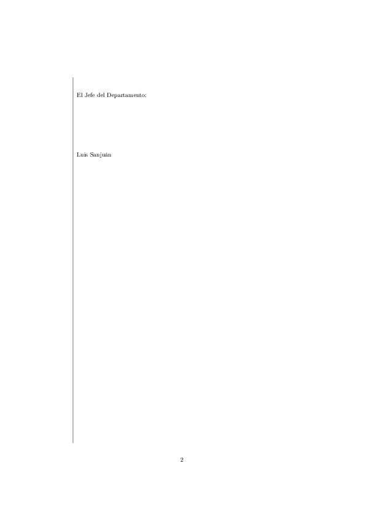

# \programa{Pandoc} realmente avanzado: plantillas \LaTeX{}
Si no surge la necesidad de añadir más materiales, me parece bien terminar
nuestro encuentro con \programa{Pandoc} con un ejemplo de uso, esta vez, sí,
realmente avanzado.

Se trata de mostrar la flexibilidad de las herramientas y de, una vez que
logramos dominar en alguna medida esa flexibilidad, saber cómo sacar provecho 
de ella para adaptarla a nuestras necesidades y automatizar la parte engorrosa 
y repetitiva de la escritura.

Esta sección va a ser más larga. Empiezo ahora a redactarla y no sé si
dividirla en varias entregas. Iré viendo por el camino. El objetivo es ver lo
que es posible. No tengo idea ahora mismo de proponer alguna práctica sobre
ella. Su propósito es ilustrativo, en el sentido de que si se conoce lo que es
posible, quizá algún día, con más tiempo o conocimientos, cada cual puede
seguir la misma o parecida estrategia.

## El objetivo concreto del ejemplo
Nuestro objetivo particular va a ser producir un acta de departamento en
\fichero{pdf} siguiendo el modelo propuesto. No seguiré la geometría exacta del
modelo, aunque es perfectamente posible si personalizamos la geometría de la
página de una forma parecida a como haremos con otras variables. No merece la
pena complicar la exposición con este detalle, por lo demás no significativo,
puesto que dicha geometría puede ser perfectamente otra, y si es la que es,
supongo que es más bien por azar y no porque sea oficialmente prescrita.

En la página siguiente tenéis una muestra de un acta que sigue el modelo del
conservatorio, tal y como se presentan en la actualidad.

## Presupuestos iniciales
Antes de plantearnos la forma de atacar el problema es conveniente recordar
lo que ya sabemos acerca de \programa{Pandoc}.

- \programa{Pandoc} es un conversor de propósito general que ofrece plantillas por
  defecto para convertir a diversos formatos.

- Para la conversión a \fichero{pdf} \programa{Pandoc} proporciona una
  plantilla \LaTeX\ por defecto.

- Ciertos elementos en dicha plantilla son variables (como el título, el autor,
  la fecha, etc) y se pueden definir para cada documento concreto mediante
  _bloques de metadatos_.

- Cualquiera de nuestras prácticas anteriores muestra con evidencia que
  la plantilla por defecto no es capaz de algo tan específico como dos
  columnas separadas por una línea. Tampoco queda claro hasta qué punto
  será complicado insertar la marca de aguas con el logo tan pegada al
  margen superior. Desde luego, nada de esto resulta obvio.

## Posibles líneas de ataque y posibilidades que investigar
Dados los presupuestos anteriores podemos plantearnos las siguientes
posibilidades, algunas expresadas en forma de preguntas o de meras tentativas.

1. Teóricamente es posible utilizar plantillas personalizadas en lugar de
   la que \programa{Pandoc} proporciona por defecto. ¿Hasta qué punto es posible?
   En concreto, ¿es posible, y cómo, crear una plantilla
   de \LaTeX\ para lograr emular el modelo de acta referido?

2. Sabemos que podemos definir variables en campos de metadatos, pero ¿qué pasa
   con variables que no están descritas en las que \programa{Pandoc} proporciona
   como tales? ¿Es posible crear variables nuevas, tales como _profesor_, _hora_
   de reunión, etc.

3. Acerca de la marca de agua del logo. Parece que habría dos opciones:
    - Modificar la geometría de la página para que la imagen del logo
      apareciera pegada al borde superior.
    - Investigar el asunto de marcas de aguas. Parece lógico pensar que algo
      tan común como una marca de agua debe de tener alguna respuesta
      relativamente sencilla.

## Plantillas personalizadas para \LaTeX{}
Procedamos una por una tratando de responder y experimentar acerca de las
líneas de actuación y preguntas antes formuladas.

En efecto, no sólo es teóricamente posible, sino realmente factible crear
plantillas personalizadas de \LaTeX\ para \programa{Pandoc}, ya sea adaptando
la plantilla por defecto, ya creando una enteramente nueva.

Como este es un documento muy particular, casi ninguna de las variables que
aparecen en la plantilla por defecto de \programa{Pandoc} nos interesan.
Tampoco nos interesan la gran cantidad de opciones que hay ahí presentes.
Ciertamente, la plantilla por defecto de \LaTeX\ que \programa{Pandoc}
suministra es muy compleja, con el fin de atender a múltiples variantes de
documentos de propósito general.  En definitiva, para hacer las cosas simples,
en otras palabras, para reducir al máximo el tamaño de nuestra plantilla,
parece razonable crear una desde cero.

Esta plantilla deberá contener todo lo necesario, y sólo lo necesario, para
reproducir el modelo. 

Naturalmente, la plantilla no es otra cosa que un documento escrito con
instrucciones y etiquetas de \LaTeX. No me voy a detener en \LaTeX, pues no es
el propósito de este curso. Además, un conocimiento suficiente de \LaTeX\ como
para crear un documento de esta clase incluye saber \LaTeX\ a un nivel como
mínimo intermedio, así como tener soltura a la hora de descubrir las
extensiones (_paquetes_ en términos de \LaTeX\) que nos serán de utilidad.  Lo
primero exige al menos un par de cursos específicos con la duración prevista
para éste. Lo segundo es cosa de experiencia. CTAN, el repositorio de paquetes
de \LaTeX, contiene miles de extensiones, con las que es posible hacer lo
imaginable y lo inimaginable a nivel tipográfico y de diseño, desde escribir en
toda clase de lenguas, escritura fonética, escritura musical, cientos de cosas
para documentos científicos, e incontables posibilidades para la creación de
diseños. En tal océano de paquetes no es fácil dar exactamente con el que nos
interesa para cada situación concreta fuera de lo común, a no ser que sepamos
de su existencia o búsquedas en Google u otros motores nos ayuden.

El problema del caso tiene diversas formas posibles de solución, desde
construir alguna clase de tabla con dos celdas, pasando por crear un documento
con dos columnas de tamaño definido por el usuario, hasta usar la opción de
notas al margen: una nota en el margen izquierdo contendría la lista de
profesores asistentes a la reunión. Esta última posibilidad es la que voy a
explorar.

El paquete de \LaTeX\ `marginnote` nos permitirá definir exactamente la 
dimensión y ubicación de la nota al margen.

Para la línea divisoria recurriré al paquete `background`, que permite 
incluir material de fondo en un documento con un control fino de los detalles 
de contenido, ubicación, etc.

Incluyo el código \LaTeX\ para ambos propósitos sin más comentario. 
Tomadlo tal cual; simplemente funciona:

~~~latex
% Linea de separación
\SetBgScale{1}
\SetBgColor{black}
\SetBgAngle{0}
\SetBgHshift{-0.52\textwidth}
\SetBgVshift{-1mm}
\SetBgContents{\rule{0.4pt}{\textheight}}

% Definiciones relativas a la nota al margen
\setlength{\marginparwidth}{35mm}
\setlength{\parindent}{0pt}
\renewcommand*{\raggedleftmarginnote}{}
\reversemarginpar
~~~

Estas personalizaciones irán en lo que en terminología \LaTeX\ se denomina 
el _preámbulo_ del documento, un apartado anterior al cuerpo del documento
propiamente dicho y que afecta a su presentación y diseño. En este preámbulo
se definen también otras características generales, como el tipo de documento,
la lengua en que esta escrito, las fuentes que usar, o ciertas dimensiones
globales como el grado de indentación en las primeras líneas de párrafos. Es,
en general, el lugar donde se recopilan todas las personalizaciones que
afectan a elementos estructurales del documento. De hecho, también he añadido
estilos para los títulos de las secciones del acta: la cabecera que, de alguna
forma, ocupa el lugar del título del acta, o su sección principal (marca `#` en
\programa{Markdown}) y la subsección correspondiente al orden del día (marca
`##` en \programa{Markdown}). Finalmente, es el preámbulo donde se _cargan_ los
paquetes que extienden \LaTeX\ más allá de su funcionalidad básica.

Nuestro preámbulo completo hasta aquí sería el siguiente:

~~~latex
\documentclass[a4paper]{extreport}
\usepackage[T1]{fontenc}
\usepackage[utf8]{inputenc}
\usepackage[spanish]{babel}
\usepackage{titlesec}
\usepackage{marginnote}
\usepackage{background}

\setlength{\parindent}{0pt}

% Línea de separación
\SetBgScale{1}
\SetBgColor{black}
\SetBgAngle{0}
\SetBgHshift{-0.52\textwidth}
\SetBgVshift{-1mm}
\SetBgContents{\rule{0.4pt}{\textheight}}

% Definiciones relativas a la nota al margen
\setlength{\marginparwidth}{35mm}
\renewcommand*{\raggedleftmarginnote}{}
\reversemarginpar

% Títulos de secciones
\titleformat{\section}[hang]{\small\bfseries}{}{0pt}{\raggedright\uppercase}
\titleformat{\subsection}[hang]{\small\bfseries}{}{0pt}{\uppercase}
\titlespacing{\section}{0pt}{-10pt}{10pt}
\titlespacing{\subsection}{0pt}{10pt}{10pt}
~~~

Además del preámbulo, y después de él, una plantilla \LaTeX\ para
\programa{Pandoc}, y en general todo documento escrito en \LaTeX\, espera lo
que se denomina el _entorno del documento_ que es donde va su texto (o
_cuerpo_) propiamente dicho. Por añadidura, una plantillas \programa{Pandoc}
(esto sí es específico de \programa{Pandoc}) necesita incluir ahí también la
variable `$body$`, que cuando procesemos nuestro documento será sustituida por
el contenido que haya en él. 

~~~latex
\begin{document}

$body$

\end{document}
~~~

En nuestro caso particular hay que añadir la comentada nota al margen con la
lista de profesores asistentes. En consecuencia, incluida la instrucción
\LaTeX\ para crear esa nota al margen, el entorno del documento en nuestra
plantilla queda así:

~~~latex
\begin{document}
\marginnote{\small\mbox{}Gómez Varas\\Patricio\\
                         Rodríguez García\\Julia Beatríz\\
                         Sanjuán Pernas\\Luis}

$body$

\end{document}
~~~

Toca procesar el acta, escrita en \programa{Markdown}, con `pandoc` haciéndole
saber que, en lugar de su plantilla por defecto, queremos usar nuestra
plantilla. Para indicar la plantilla que aplicar, se utiliza la opción

    --template <nombre_plantilla>.latex

Guardemos nuestra plantilla con el nombre \fichero{plantilla\_acta.latex} y
supongamos, además, que tenemos escrita ya el acta en el fichero
\fichero{acta.md}.  El acta tiene este aspecto ya familiar:

~~~
%%% acta_v1.md
# Acta de la reunión del departamento de guitarra celebrada el día 30 de septiembre de 2014

Se inicia la sesión a las 20:00 horas del 30 de septiembre
de 2014 en el aula 18 del centro.

## Orden del día 

1.  Lectura y aprobación, si procede, del acta de la reunión anterior.
2.  Comentario del borrador de la programación.
3.  Otros asuntos

1.  Lectura y aprobación, si procede, del acta de la reunión anterior. 

    Se lee el acta de la reunión anterior, que se aprueba.

2.  Comentario del borrador de la programación. 

    Se pone en conocimiento de Patricio del borrador de la nueva programación. 
    No hay ningún cambio esencial con respecto de la del curso pasado. 
    Pero hay muchos cambios formales, particularmente en la programación 
    de conjunto.

    Asimismo, se decide (como quedó comentado en la última reunión del 
    curso pasado) mantener la idea de una audición pública final donde el 
    grueso de la participación corresponderá a grupos, surgidos de las 
    clases colectivas y la de conjunto.

3.  Otros asuntos. 

    - Se decide fecha para la audición final, que será, dependiendo de 
      la ocupación, en el aula de Orquesta o de Coro, un viernes en torno 
      a las 18.00h (para facilitar la participación de los más pequeños) y a 
      principios de junio. Se trasmitirá a Jefatura dicha solicitud.

    - En otro orden de cosas, se informa de la novedad para este curso de 
      que la memoria del departamento debe incluir un adjunto con las faltas 
      de los alumnos durante el curso.

Y sin más asuntos que tratar se cierra la sesión a las 21:00 horas del 30
de septiembre de 2014.

El Jefe del Departamento:

Luis Sanjuán

%% fin del acta
~~~

Tenemos todas las piezas preparadas, el acta con nombre \fichero{acta\_v1.md} y
la plantilla \LaTeX\, con nombre \fichero{plantilla\_acta.latex}.

Ejecutemos, pues, `pandoc` como otras veces, pero ahora añadiendo la opción 
`--template` que acabo de comentar:

    pandoc -s --template plantilla_acta.latex -o acta_v1.pdf acta.md

Una imagen del \fichero{pdf} resultante se muestra en la página 
siguiente.

¡Estupendo! Esto se aproxima bastante al modelo. Pero hay todavía
algunos problemas imprevistos.

El más grave corresponde a las numeraciones de las listas. La lista del orden
del día consta de tres elementos; la correspondiente lista del comentario sobre
esos elementos consta también de tres, pero debería haber comenzado con 1, en
lugar de continuar la numeración de la lista anterior. La razón de este
problema es que la especificación de \programa{Markdown} no cuenta con que
alguien va a construir dos listas seguidas independientes, y el contador de los
elementos es inconsciente del número concreto que pongamos. Dicho de otra
forma, cuando \programa{Markdown} ve un número, el que sea, lo toma por "esto
es un elemento de una lista numerada", pero la numeración, el conteo, lo hace
automáticamente, sin consideración del número particular que se ponga.
\programa{Pandoc}, supuestamente, proporciona una extensión que tiene en cuenta
el número concreto que indiquemos y hay varias formas de resolver este
problema.

El segundo problema tiene que ver con el espaciado vertical.  Ciertamente lo
que son distintas secciones del documento: título, orden del día, exposición,
cierre de sesión y firma, no han sido etiquetadas como tales secciones y el
texto de unas se agolpa en el de las otras.

Podemos crear secciones con títulos invisibles con las mismas marcas de
secciones que conocemos, de manera tal que nuestro documento siguiese este
esquema:

~~~
# Cabecera principal 

## Orden del día

Aquí va el orden del día

##

Aquí va la exposición

##

Aquí va el cierre de sesión

##

Aquí iría la firma
~~~

Notad que uso las marcas de sección, pero sin titular las secciones
para atenerme al modelo, donde tales secciones vienen sin títulos.

Hago las modificaciones correspondientes en nuestro fichero
\fichero{acta\_v1.md}, lo guardo como \fichero{acta\_v2.md} y vuelvo a ejecutar
la instrucción anterior `pandoc` con el fichero de salida como
\fichero{acta\_v2.pdf} y el fichero de entrada \fichero{acta\_v2.md}. Se
obtiene el resultado que se muestra en la página siguiente.

El problema del espaciado ha desaparecido y, como por arte de magia, también el
problema en la numeración de las dos listas.  Esto segundo es así porque
sucesiones de elementos de lista pertenecen a distintas listas si dichas
sucesiones forman parte de distintas estructuras, en este caso subsecciones.
Así, por tanto, hemos resuelto dos problemas en uno, por el simple hecho de
estructurar nuestros documentos, en lugar de escribir sin atender a la lógica
interna de lo que escribimos.

Un par de retoques (con \LaTeX\) finalizan la emulación del modelo.  El primero
es la línea horizontal que en el modelo separa el orden del día de la
exposición. Aunque creo que esto fue un añadido mío y no forma parte del modelo
que inicialmente me entregó Alberto. El segundo retoque es añadir más espacio
vertical para la firma, particularmente para la mía que ocupa bastante.

Sabemos que podemos añadir instrucciones \LaTeX\ dentro de documentos
\programa{Markdown} y que van a funcionar. Lo hemos comentado de pasada en el
foro.

Los fragmentos pertinentes de nuestro documento con las instrucciones \LaTeX\
incorporadas son los siguientes.

Para añadir la línea de separación tras el orden del día:

~~~
## Orden del día 

1.  Lectura y aprobación, si procede, del acta de la reunión anterior.
2.  Comentario del borrador de la programación.
3.  Otros asuntos

\begin{flushright}\rule{5mm}{.5mm}\end{flushright}
~~~

Para añadir espacio vertical para la firma:

~~~
El Jefe de Departamento:

\vspace*{3cm}

Luis Sanjuán
~~~

No me detengo en esto, pues son cosas específicas de \LaTeX.

Si proceso de nuevo el documento con `pandoc` con estas modificaciones y
cambiando los nombres de archivos como corresponda, obtengo el resultado final,
que se muestra en las dos páginas siguientes. Ocupa dos páginas esta vez. No
está mal. Así comprobamos también que la plantilla sigue funcionando con
documentos multi-página.

## El logo. Marcas de agua con \programa{PDFtk}
Para incluir el logotipo del centro en la parte superior del acta disponemos,
como comentaba al principio, de varias opciones. Podríamos usar el paquete
`background` u otros paquetes especializados de \LaTeX\ como el paquete
`watermark`. Pero no necesitamos un control tan fino.  Bastará con una
herramienta de propósito general para la manipulación de \fichero{pdf}s, como
es \programa{PDFtk}, que además es multiplataforma. Más información sobre
\programa{PDFtk} en su página web:

<https://www.pdflabs.com/tools/pdftk-the-pdf-toolkit/>

\programa{PDFtk} es muy útil para muchas cosas que tienen que ver con
manipulación de ficheros \fichero{pdf}. Para incluir marcas de agua desde la
línea de comandos, la instrucción es la siguiente:

    pdftk <fichero-input>.pdf background <marca-agua>.pdf output <fichero-output>.pdf

He creado un fichero \fichero{pdf} a partir del logotipo con el nombre de
fichero \fichero{membrete.pdf}, que está en el mismo directorio que el resto de
ficheros relativos a actas que hemos visto. A partir de nuestro último
\fichero{pdf} que, recuerdo, se llamaba \fichero{acta\_v3.pdf} voy a crear un
fichero al que añadiré el logotipo y que llamaré \fichero{acta\_v4.pdf}. La
instrucción será la siguiente:

    pdftk acta_v3.pdf background membrete.pdf output acta_v4.pdf

El resultado de la primera página (la segunda página también lo incluye)
aparece en la figura 6.

Es suficiente ver que funciona como esperamos. Detalles no significativos para
el propósito de la exposición como un encuadre mejor acabado entre el logotipo
y la página, la dimensiones exactas de la página y de sus elementos, el grosor
de la línea de separación, etc. son cuestiones que se pueden modificar ya sea
ajustando la imagen del logotipo, ya refinando las dimensiones de la página. Se
trata de jugar con números hasta obtener lo que se ajusta a nuestros gustos.

## Variables
Hasta aquí el trabajo ha sido completado con éxito. Pero al sufrido jefe de
departamento le surgirá una pregunta ineludible. Bien, ahora ya puedo escribir
las actas mediante \programa{Markdown} y quitarme un montón de problemas con la
edición directa de \fichero{pdf}s. Pero ya que estamos, ¿no sería genial evitar
también el trabajo repetitivo de incluir los profesores, ya sea volviendo a
escribir sus nombres o borrando a los no asistentes? ¿Y qué con todas esas
fechas y horas repetidas una y otra vez a lo largo del documento?

Pues sí, se puede, y para eso están las variables de \programa{Pandoc} y los
bloques de metadatos. Hasta ahora, en una práctica anterior, hemos aprendido a
usar variables preestablecidas por \programa{Pandoc}.  Pero \programa{Pandoc},
a través de sus plantillas, permite también crear nuestras propias variables e
incluir sus valores en ficheros de metadatos.

En la práctica anterior sobre este tema, para simplificar, comenté que el
bloque de metadatos debería estar al principio del documento que se procesa.
Recordamos que había una marca para ello:

    ---
    Aquí van los campos de metadatos
    ---

Pero también es posible crear un fichero independiente de metadatos.

Tampoco me voy a detener en este punto, salvo que alguno de vosotros me indique
que quiere profundizar en él. El fichero de metadatos tiene la extensión
\fichero{yaml}. Voy a llamar a nuestro fichero de metadatos para el acta
\fichero{variables.yaml} y su contenido es el siguiente:

    ---
    day: 30
    month: Septiembre
    year: 2014
    start: 20:00
    end: 21:00
    prof:
    - a: Gómez Varas
      n: Patricio
    - a: Rodríguez García
      n: Julia Beatríz
    - a: Sanjuán Pernas
      n: Luis
    ---

Cada campo tiene un nombre. He escogido un nombre en inglés para que sea más
fácil de diferenciar en la plantilla, pero podría ser uno en español, aunque
sin acentos ni la ñ. Tras cada campo separado por dos puntos va su valor.
Cuando los campos contienen varios valores estos se se marcan con guión. Se
permite también que los campos tengan miembros. Cada miembro de un campo tiene
a su vez su nombre, aquí `a` por apellido y `n` por nombre. Este formato no es
\programa{Markdown}, sino \programa{YAML}:

<http://www.yaml.org/>

Se usa en varios ámbitos, y \programa{Pandoc} lo soporta para proporcionar su
opción de metadatos y variables en plantillas.

Para que el tinglado funcione hay que hacer dos cosas más:

- Sustituir los profesores por variables en la plantilla \LaTeX.

- Incluir nuevas zonas con variables en la plantilla, precisamente
  aquellas que no cambiar de una acta a otra.

Respecto de este último punto. Si pensamos en sustituir los valores de fechas y
horas por variables, resulta que son zonas del documento que no cambiarán de un
acta a otra y que, por tanto, son perfectamente susceptibles de ser incluidas
en la plantilla.

Nuestra plantilla se debe transformar del modo siguiente para ganar la
flexibilidad perseguida:

~~~
\begin{document}
\marginnote{\small \mbox{}$for(prof)$$prof.a$\\$prof.n$\\ $endfor$} 

\section{Acta de la reunión del departamento de Guitarra del $day$ de $month$ de $year$ ...}

Se inicia la sesión a las $start$ horas ...

$body$

\subsection{}

Y sin más asuntos que tratar se cierra la sesión a las $end$ horas ...

\subsection{}

El Jefe del Departamento

\vspace*{3cm}

Luis Sanjuán
\end{document}
~~~

Por su parte, el acta misma, nuestro documento, que ahora llamaré
\fichero{acta.md} queda simplificada notablemente en su versión definitiva,
pues partes de ella han ido a parar a la plantilla misma:

~~~
## Orden del día 

1.  Lectura y aprobación, si procede, del acta de la reunión anterior.
2.  Comentario del borrador de la programación.
3.  Otros asuntos

\begin{flushright}\rule{5mm}{.5mm}\end{flushright}

##

1.  Lectura y aprobación, si procede, del acta de la reunión anterior. 

    Se lee el acta de la reunión anterior, que se aprueba.

2.  Comentario del borrador de la programación. 

    Se pone en conocimiento de Patricio del borrador de la nueva programación. 
    No hay ningún cambio esencial con respecto de la del curso pasado. 
    Pero hay muchos cambios formales, particularmente en la programación 
    de conjunto.

    Asimismo, se decide (como quedó comentado en la última reunión del 
    curso pasado) mantener la idea de una audición pública final donde el 
    grueso de la participación corresponderá a grupos, surgidos de las 
    clases colectivas y la de conjunto.

3.  Otros asuntos. 

    - Se decide fecha para la audición final, que será, dependiendo de 
      la ocupación, en el aula de Orquesta o de Coro, un viernes en torno 
      a las 18.00h (para facilitar la participación de los más pequeños) y a 
      principios de junio. Se trasmitirá a Jefatura dicha solicitud.

    - En otro orden de cosas, se informa de la novedad para este curso de 
      que la memoria del departamento debe incluir un adjunto con las faltas 
      de los alumnos durante el curso.
~~~

Este último tipo de documento es lo que tendría que escribirse cada vez que se
redacta un acta. El resto está automatizado gracias a \programa{Pandoc} y a
nuestra plantilla.

Notad bien dos cambios sustanciales en la plantilla, aparte de las variables
y secciones añadidas.

- La variable `$body$` va exactamente allí donde irá el contenido sin
  variable alguna del acta, o sea, lo que redactará el jefe de departamento.

- Las etiquetas de sección y subsección de \programa{Markdown}, `#` y `##`,
  respectivamente han sido sustituidas donde corresponde por sus equivalentes
  en \LaTeX\ `\section` y `\subsection`. Esto último es compresible, puesto que
  nuestra plantilla es una plantilla \LaTeX, que debe escribirse enteramente
  con marcas de \LaTeX.

Recordemos los documentos que hemos generado y los ficheros con los que
estamos trabajando en su forma final:

- \fichero{acta.md}: el acta final en cuanto tal, escrita en \programa{Markdown}
- \fichero{plantilla\_acta.latex}: la plantilla en \LaTeX
- \fichero{variables.yaml}: el bloque de metadatos
- \fichero{membrete.pdf}: el \fichero{pdf} que contiene el logo para la marca
  de agua

La instrucción `pandoc` para generar el acta final es ligeramente diferente a
las que hemos visto, pues debe añadir al final el nombre del fichero del
bloque de metadatos. Sería, en definitiva, la siguiente:

    pandoc -s -o acta.pdf --template plantilla_acta.latex acta.md variables.yaml

El resultado \fichero{acta.pdf} es exactamente igual que el de las figuras 4 y
5 anteriores, es decir el acta sin la marca de agua. Sobre este \fichero{pdf}
es sobre el que habría que incluir la marca de agua como antes describimos,
mediante la instrucción:

    pdftk acta.pdf background membrete.pdf output acta_con_logo.pdf

Cambié el orden de la exposición natural e introduje antes el asunto de la marca 
de agua para dejar este aspecto de las variables, más difícil, para el final. 

## Aplicaciones prácticas
Éste u otro tipo de exposiciones similares sobre otro tipo de documentos muestran
de qué forma sería posible crear un proceso para la generación de documentos
oficiales de manera que el trabajo no fuera oneroso para nadie y estuviera
distribuido.

1. Alguien con suficientes conocimientos y tiempo crearía la infraestructura,
   en este caso, construiría la plantilla de \LaTeX\ para \programa{Pandoc} y
   el esqueleto del fichero que contiene el campo de metadatos.

2. El profesor redactaría de una forma muy simple su documento, en este caso,
   escribiría el acta y rellenaría el campo de metadatos. En caso de documentos
   conjuntos, los distintos profesores modificarían sin dificultad un texto plano.

3. El responsable de producir los documentos finales se limitaría a ejecutar
   `pandoc` y `pdftk` y a imprimir los \fichero{pdf}s.

En este ciclo la parte más trabajosa y que lleva más tiempo es la creación
de la plantilla. Pero también es cierto que, una vez creadas, es trabajo que
revierte en el futuro reduciendo su lado repetitivo y engorroso.

En el foro adjunto los ficheros finales arriba comentados por si alguno quiere
experimentar. Si el procesamiento falla puede ser porque en vuestra instalación 
básica de \TeX\ falte alguno de los paquete \LaTeX\ que he aplicado. En tal caso,
sería simplemente cuestión de instalarlos.
