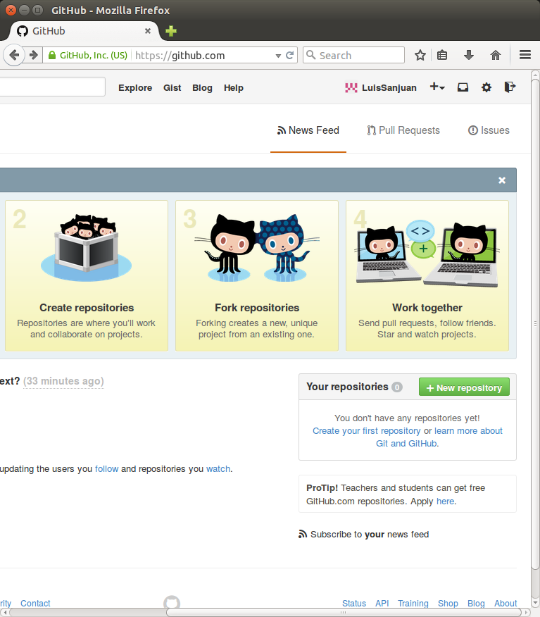
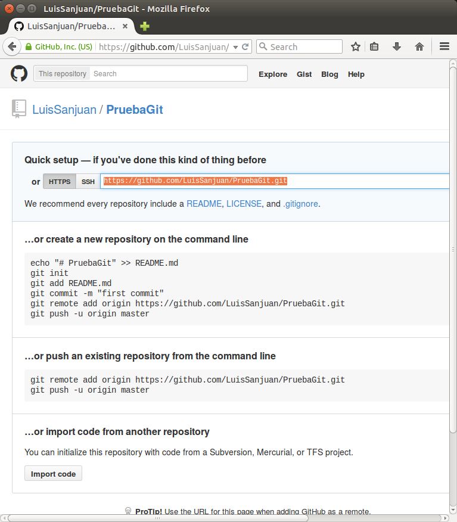

# Cuentas \programa{GitHub} y repositorios remotos
\programa{GitHub} es una plataforma de hosting de repositorios \programa{Git}.

Puesto que \programa{Git} soporta comunicación e interacción con repositorios
remotos, podemos crear una cuenta en \programa{GitHub} para que aloje nuestros
repositorios. Como vimos en una sección anterior, el repositorio remoto en
\programa{GitHub} y nuestro repositorio local en nuestro ordenador serán
réplicas. Las ventajas de ello son obvias:

- Disponer de una versión de nuestros repositorios en la nube añade una mayor
  integridad a nuestros datos. Si, por cualquier motivo, nuestro repositorio
  local o nuestro ordenador se destruye, podemos recuperar todo el trabajo
  clonando el repositorio remoto.

- Disponer de un hosting común para todos los miembros de un grupo que trabajan 
  sobre los mismos proyectos en los mismos repositorios.

Aparte de \programa{GitHub}, existen otros servicios que dan soporte semejante,
como \programa{Bitbucket} o \programa{GitLab}. Si nos concentramos en
\programa{GitHub} es por ser el más conocido y porque, por ello, es probable
que dudas que puedan surgir encontrarán más fácilmente respuesta vía Goggle u
otros buscadores.

\programa{GitHub} proporciona cuentas gratuitas a cualquiera que lo desee. Pero
con una restricción, los repositorios que se creen serán públicos. La opción
de repositorios privados es una alternativa de pago.

Me ha parecido más accesible presentar \programa{GitHub}. Al fin y al cabo, lo
que vayamos a hacer allí carecerá de datos personales, más allá de nuestras
pruebas, que a nadie interesan, y de nuestros nombres e emails, los que
decidáis establecer para vuestros repositorios (los nombres de usuario pueden
ser seudónimos), que estarán ya por otras partes en la web. Una vez ganada
experiencia en \programa{Git} remoto, se puede acceder a un plan privado de
pago, o bien buscar otro servicio gratuito de hosting privado, como
\programa{Bitbucket}, aunque \programa{Bitbucket} tiene hoy por hoy un límite
de 5 usuarios máximo por grupo.

No me ha sido fácil decidirme entre \programa{GitHub} y \programa{Bitbucket}.
En lo esencial, ambos funcionan del mismo modo. Yo tengo ya cuenta gratuita
en \programa{GitHub} y repositorios públicos que me interesan que lo sean, por
eso de abrir el conocimiento. Pero entiendo que, en ciertos casos, los repositorios
privados pueden ser necesarios.

## Creación de una cuenta en \programa{GitHub}
La creación de una cuenta en \programa{GitHub} es trivial. Más información, con
pantallazos, en el libro citado en una sesión anterior:

<http://git-scm.com/book/en/v2/GitHub-Account-Setup-and-Configuration>

Los pasos son, básicamente:

1. Ir a <http://github.com>. Rellenar los campos del formulario y crear la
   cuenta. Poned como email el mismo que elegísteis al configurar
   \programa{Git}.

2. Elegir el plan (gratis) y confirmar la creación del
   cuenta.

3. Verificar la cuenta siguiendo el email que os envíen. 

4. Opcionalmente se puede crear una clave SSH que permite algunas otras
   opciones (ver libro). Yo no la he creado.

5. Opcionalmente se puede pedir una autenticación en 2 pasos (ver libro).
   Tampoco lo he hecho.

Con esto hemos creado la cuenta y podemos empezar a usarla.

## Creación de un repositorio remoto
El siguiente paso es crear en \programa{GitHub} un repositorio. La pantalla
que aparece después de la creación de la cuenta incluye un botón para hacer esto,
el botón verde 'New repository'.

El repositorio debería tener el mismo nombre que nuestro repositorio local. En
el caso de nuestro ejemplo anterior \fichero{PruebaGit}.

Es esencial tomar nota de la URL que aparece tras la creación en el primer
campo que aparece en la siguiente pantalla. En vuestro ordenador
será distinta de la mía, claro está.

## Subir nuestro repositorio local
La siguiente operación se hace desde nuestro ordenador con \programa{Git}.
Primero vamos a nuestro directorio supervisado por \programa{Git}, como
de costumbre. En mi caso, como recordaremos, es \fichero{PruebaGit}.

Desde ahí hay que ejecutar el siguiente comando:

    git remote add origin repo_url

donde `repo_url` es la dirección URL que copiamos de la página anterior.

Con mi URL (la vuestra será distinta), sería así:

    git remote add origin https://github.com/LuisSanjuan/PruebaGit.git

Dicho comando establece la asociación entre nuestro repositorio local y el
repositorio remoto. Sólo hay que ejecutarlo una vez por repositorio que creemos.
Esa asociación quedará registrada en la base de datos del repositorio. Es
una opción de configuración de \programa{Git} como aquellas que ejecutamos
en anteriores sesiones (`git config`), salvo que ésta de ahora tiene una
sintaxis especial. Podéis ver vuestro fichero de configuración para comprobar
que el nuevo dato se ha incluido. Está en \fichero{.git/config} dentro del
repositorio local:

~~~
[core]
        repositoryformatversion = 0
        filemode = true
        bare = false
        logallrefupdates = true
        editor = vim
[user]
        name = Luis Sanjuán
        email = luisj.sanjuan@gmail.com
[remote "origin"]
        url = https://github.com/LuisSanjuan/PruebaGit.git
        fetch = +refs/heads/*:refs/remotes/origin/*
~~~

Después del comando anterior, lo siguiente que hacer es subir nuestro
repositorio local a \programa{GitHub}:

    git push -u origin master

que viene a decir: "git, mete los datos de mi rama _master_ a la rama _master_ del
repositorio remoto (llamado _origin_)". Recordemos que nuestra única rama, la
que \programa{Git} crea por defecto al iniciarse, es _master_.

Os pedirá nombre de usuario y contraseña. Los que elegisteis al crear la
cuenta en \programa{GitHub}.

La opción `-u` de `git push` permite que en posteriores subidas de datos ya no
sea necesario incluir los términos `origin` y `master`.

En definitiva, el comando `git push` a partir de ahora será la forma en que
actualicemos nuestro repositorio remoto de modo que contenga la última
instantánea de nuestro repositorio local.

Podéis confirmar que la operación se ha ejecutado, observando el estado de
\programa{Git}:

~~~
$ git status
On branch master
Your branch is up-to-date with 'origin/master'.

nothing to commit, working directory clean
~~~

También se puede ver cómo el repositorio remoto ha cambiado, visitando su
correspondiente página web en \programa{GitHub}, que tendrá este formato:

    https://github.com/nombreUsuario/nombreRepositorio

En mi caso particular, es la siguiente:

<https://github.com/LuisSanjuan/PruebaGit>

En esa misma página (la que corresponda a vuestro repositorio remoto, no la
mía) podéis navegar sobre la interfaz. Veréis el historial de confirmaciones,
las ramas (tenemos sólo una), estadísticas y otras informaciones de interés.

## Ejercicios
Seguid la estrategia comentada:

1. Crear una cuenta en \programa{GitHub}.

2. Crear un repositorio en \programa{GitHub} con el nombre del
   repositorio local.

3. Establecer la asociación entre el repositorio local y el remoto.

4. Subir los datos, o, en otras palabras, actualizar el
   repositorio remoto con el contenido del repositorio local.

5. Como confirmación del éxito de las operaciones, poned en el foro
   la dirección URL de vuestro repositorio remoto.

## Resumen de comandos
- `git remote add origin <repo_url>`: Establece la asociación entre
   el repositorio local y el remoto.

- `git push -u origin master`: Actualiza el contenido del repositorio
  remoto con el contenido actual del repositorio local. Además,
  a través de la opción `-u` evita tener que introducir los nombres
  `origin` y `master` en futuras invocaciones de `git push`.
